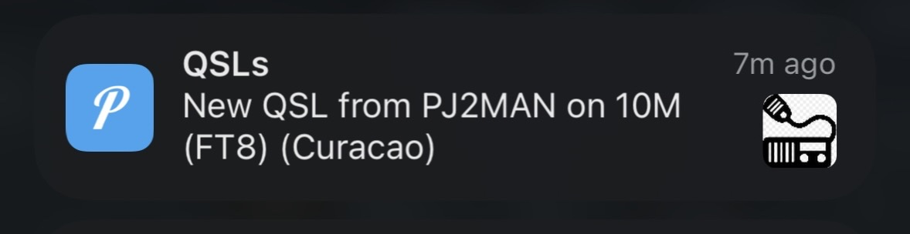

## Logbook Of The World QSL Notifier

This script will poll LoTW every 10 minutes and send you a push notification if you get a new confirmation (QSL) from LoTW.

This is a very basic nodejs script.  It requires that you run it full time on a Raspberry Pi or other computer with nodejs installed

It uses pushover.net to send push notifications.  You'll need to sign up for a Pushover.Net account on the web & install the mobile app.  On the web, create a new 'app' in your Pushover account. You'll get an app token, when combined with your user token, will allow this script to send you notifications.

It could be easily modified to send text messages or emails...

### Installation

1. Clone the repo
2. Run `npm install`
3. Edit the `config/defaut.json` file and provide your LoTW username(usually your callsign) and password, as well as Pushover.Net credentials.
4. Run `npm start`

Use something like `pm2` to keep it running!